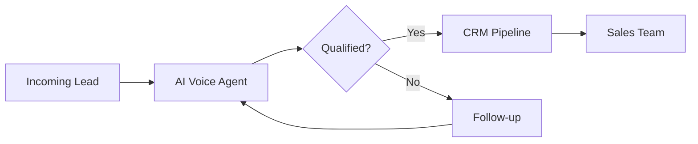
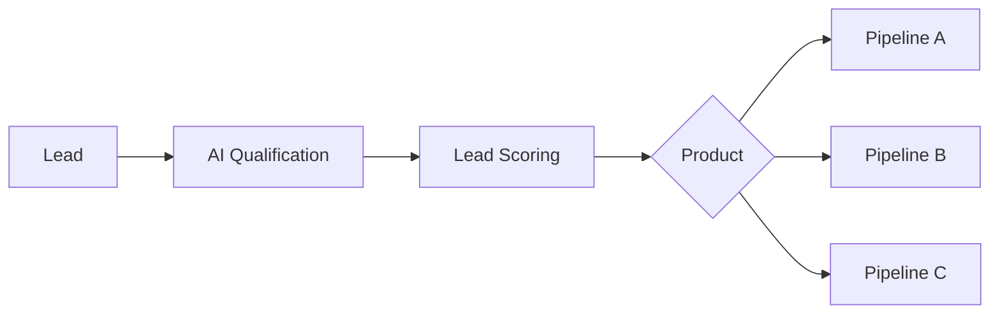

<div align="center">


### Building intelligent systems that automate real operations.

<p>
  <a href="https://www.linkedin.com/in/rafael-florindo">
    
  </a>
  <a href="mailto:rafaelflorindodev@gmail.com">
    
  </a>
  <a href="https://wa.me/5531997900284">
    
  </a>
</p>

</div>

---

## 👨‍💻 About me

```yaml
name: Rafael Florindo
role: Automation & AI Engineer

focus:
  - AI Agents
  - Business Automation
  - CRM Architecture
  - APIs & Integrations
  - SaaS Development

working_with:
  - GoHighLevel
  - n8n
  - OpenAI
  - Python
  - Next.js
  - Supabase
```

Trabalho desenvolvendo **automações, agentes de IA e sistemas integrados a CRM** para transformar processos operacionais manuais em infraestruturas automatizadas.

Atualmente atuo com implementações técnicas na **High Ticket Club**, principalmente com **GoHighLevel, n8n, APIs, agentes de IA e integrações**.

Também curso **Ciência da Computação na Univértix**.

> **Meu foco não é apenas automatizar tarefas.
> É transformar operações em sistemas.**

---

## ⚡ What I build

<table>
<tr>

<td width="50%" valign="top">

### 🤖 AI Agents

Agentes inteligentes para:

* atendimento;
* qualificação;
* vendas;
* suporte;
* voz;
* triagem.

**Stack**

`OpenAI` `VAPI` `ElevenLabs` `Twilio`

</td>

<td width="50%" valign="top">

### ⚙️ Automation

Automação de processos utilizando:

* webhooks;
* APIs;
* workflows;
* event-driven flows;
* integrações entre plataformas.

**Stack**

`n8n` `Python` `REST API` `Webhooks`

</td>

</tr>

<tr>

<td width="50%" valign="top">

### 🧩 CRM Architecture

Implementações completas de CRM:

* pipelines;
* workflows;
* snapshots;
* onboarding;
* lead routing;
* scoring.

**Stack**

`GoHighLevel` `n8n` `APIs`

</td>

<td width="50%" valign="top">

### 💻 Software

Aplicações integradas com automações e IA.

* SaaS;
* dashboards;
* APIs;
* backends;
* bancos de dados.

**Stack**

`Next.js` `Node.js` `Python` `Supabase`

</td>

</tr>
</table>

---

# 🚀 Selected Projects

## 🎙️ AI Voice Agents

> Agentes de IA capazes de atender, qualificar e direcionar leads automaticamente por telefone.



**Tecnologias**

`VAPI` · `ElevenLabs` · `Twilio` · `GoHighLevel`

---

## 🏗️ Automated GHL Provisioning

Provisionamento automático de subcontas GoHighLevel a partir do onboarding do cliente.

```text
Client Form
     ↓
Webhook
     ↓
n8n
     ↓
GoHighLevel API
     ↓
Subaccount
     ↓
Custom Values
     ↓
Ready to use
```

### O sistema automatiza

* criação da estrutura;
* preenchimento de Custom Values;
* configuração inicial;
* distribuição de dados;
* preparação da subconta.

**Stack**

`n8n` · `GoHighLevel API` · `Webhooks`

---

## 📊 AI Call Scoring

Pipeline de inteligência artificial para análise automática de ligações comerciais.

```text
Sales Call
    ↓
Transcription
    ↓
LLM Analysis
    ↓
Script Comparison
    ↓
Score
    ↓
Dashboard
```

Analisa fatores como:

* aderência ao script;
* objeções;
* qualidade da abordagem;
* etapas da call;
* oportunidades de melhoria.

**Stack**

`OpenAI` · `Whisper` · `n8n` · `Google Sheets`

---

## 🚦 AI Lead Qualification

CRM com triagem automática e roteamento inteligente de oportunidades.



**Stack**

`GoHighLevel` · `n8n` · `Next.js` · `Supabase`

---

## 📦 GoHighLevel Snapshots

Estruturas de CRM reutilizáveis para diferentes segmentos.

```text
Snapshots
├── Advocacia
├── Odontologia
├── Concessionárias
├── Clínicas
├── Estética
└── Franquias
```

Cada estrutura pode incluir:

`Pipelines` · `Workflows` · `Calendars` · `Forms` · `Custom Values` · `Automations`

---

## ⚽ MatchGoal

SaaS de analytics esportivo desenvolvido com foco na **Copa do Mundo de 2026**.

```text
Football Data
      ↓
Data Processing
      ↓
Supabase
      ↓
Analytics Engine
      ↓
Next.js Dashboard
```

**Stack**

`Next.js` · `Supabase` · `Vercel` · `n8n`

---

> 🔒 Parte das implementações profissionais está em repositórios privados ou vinculada a projetos de clientes.

---

# 🛠️ Tech Stack

<div align="center">

### AI & Automation


&nbsp;&nbsp;

&nbsp;&nbsp;


<br/><br/>

`OpenAI` · `n8n` · `VAPI` · `ElevenLabs` · `LangChain`

---

### Backend


---

### Frontend


---

### Database & Infrastructure


---

### Development


</div>

---

# 🧠 Current Focus

```javascript
const currentlyExploring = [
  "AI Agents",
  "Multi-Agent Systems",
  "LLM Workflows",
  "AI + CRM",
  "Automation Architecture",
  "Developer Tools with AI"
];
```

---

# 🎓 Research

### Generative AI × Software Engineering

**Análise Comparativa entre Reuso Tradicional de Código e Desenvolvimento Assistido por IA Generativa**

Pesquisa experimental desenvolvida na **Univértix** sobre o impacto da IA generativa na produtividade de desenvolvedores.

O estudo analisa:

| Métrica             | Objetivo                      |
| ------------------- | ----------------------------- |
| ⏱️ Tempo            | Velocidade de desenvolvimento |
| ✅ Corretude         | Resultado funcional           |
| 🧹 Qualidade        | Estrutura e legibilidade      |
| 🧪 Testes           | Aprovação funcional           |
| 🔧 Manutenibilidade | Facilidade de evolução        |

### Questão central

> **A IA torna desenvolvedores realmente mais produtivos ou apenas mais rápidos?**

---

# 📈 GitHub

<div align="center">


</div>

---

<div align="center">

## Let's build something.

**AI Agents · Automation · CRM · APIs · SaaS**

<br/>

<a href="https://www.linkedin.com/in/rafael-florindo">

</a>

<br/><br/>


</div>
