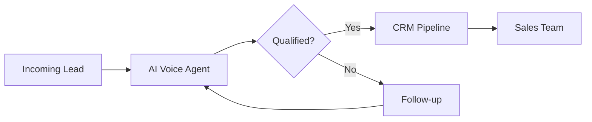
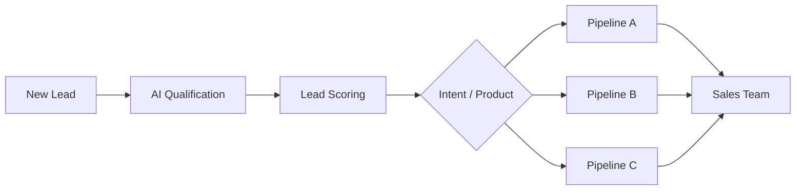

<div align="center">

# Rafael Florindo

### Automation & AI Engineer

**AI Agents · Business Automation · CRM Architecture · APIs · SaaS**

<br/>

I build intelligent systems that connect **AI, automation and CRM infrastructure** to transform manual operations into scalable workflows.

<br/>

<a href="https://www.linkedin.com/in/rafael-florindo">
  
</a>
<a href="mailto:rafaelflorindodev@gmail.com">
  
</a>
<a href="https://wa.me/5531997900284">
  
</a>

<br/><br/>


</div>

---

## About me

I work at the intersection of **software engineering, artificial intelligence and business automation**.

My focus is designing systems that automate operational processes such as:

* lead qualification;
* customer service;
* follow-up;
* CRM management;
* lead routing;
* onboarding;
* sales call analysis;
* internal operations.

Currently, I work on technical implementations at **High Ticket Club**, building solutions primarily with **GoHighLevel, n8n, APIs and AI agents**.

I also study **Computer Science at Univértix**, which gives me the technical foundation to move beyond no-code platforms whenever an implementation requires custom logic, APIs, backend development or infrastructure.

> **I don't build automation just to eliminate clicks.
> I build systems that can operate reliably in production.**

---

## Core expertise

<table>
<tr>

<td width="33%" valign="top">

### 🤖 AI Agents

AI-powered agents for:

* lead qualification
* customer support
* sales assistance
* voice conversations
* triage
* follow-up
* routing

<br/>

**Technologies**

`OpenAI`
`VAPI`
`ElevenLabs`
`Twilio`

</td>

<td width="33%" valign="top">

### ⚙️ Automation

Workflow orchestration for:

* repetitive operations
* system integrations
* webhooks
* API calls
* data processing
* event-driven workflows

<br/>

**Technologies**

`n8n`
`Python`
`REST APIs`
`Webhooks`

</td>

<td width="33%" valign="top">

### 🧩 CRM Architecture

CRM implementations involving:

* pipelines
* workflows
* snapshots
* custom values
* onboarding
* lead routing
* scoring

<br/>

**Technologies**

`GoHighLevel`
`n8n`
`APIs`

</td>

</tr>
</table>

---

## Selected projects

### 🎙️ AI Voice Agents

AI voice agents integrated with CRM infrastructure to automate lead conversations, qualification and routing.



#### Main capabilities

* automated inbound calls;
* conversational lead qualification;
* intent identification;
* CRM updates;
* automatic follow-up;
* routing qualified leads to sales representatives;
* callback sequences.

**Stack**

`VAPI` · `ElevenLabs` · `Twilio` · `GoHighLevel`

---

### 🏗️ Automated GoHighLevel Provisioning

Automation responsible for creating and configuring GoHighLevel subaccounts directly from customer onboarding information.

```text
Client Onboarding
       │
       ▼
    Webhook
       │
       ▼
      n8n
       │
       ▼
 GoHighLevel API
       │
       ▼
Subaccount Created
       │
       ▼
 Custom Values
       │
       ▼
 Environment Ready
```

#### The workflow can automate

* subaccount creation;
* initial configuration;
* custom value population;
* onboarding data distribution;
* business information setup;
* snapshot preparation;
* workflow initialization.

**Stack**

`n8n` · `Webhooks` · `GoHighLevel API`

---

### 📊 AI Sales Call Scoring

Automated pipeline for evaluating sales calls using transcription and large language models.

```text
Sales Call
    │
    ▼
Transcription
    │
    ▼
LLM Analysis
    │
    ▼
Script Comparison
    │
    ▼
Call Scoring
    │
    ▼
Report / Dashboard
```

#### Evaluation can include

* script adherence;
* discovery quality;
* objection handling;
* sales process execution;
* missed opportunities;
* conversation quality;
* improvement recommendations.

**Stack**

`OpenAI` · `Whisper` · `n8n` · `Google Sheets`

---

### 🚦 AI Lead Qualification & Routing

CRM architecture capable of automatically analyzing leads, determining intent and routing opportunities to the appropriate pipeline.



#### System responsibilities

* lead capture;
* automated triage;
* lead scoring;
* product identification;
* opportunity routing;
* CRM pipeline updates;
* executive visibility.

**Stack**

`GoHighLevel` · `n8n` · `Next.js` · `Supabase`

---

### 📦 GoHighLevel Snapshot Architecture

Reusable GoHighLevel environments built for different business verticals.

```text
Snapshots
│
├── Legal
├── Dentistry
├── Automotive
├── Aesthetic Clinics
├── Franchises
└── Service Businesses
```

Each structure can contain:

* pipelines;
* workflows;
* forms;
* calendars;
* custom fields;
* custom values;
* automations;
* onboarding processes;
* communication sequences.

**Stack**

`GoHighLevel` · `Workflows` · `Custom Values` · `Automation`

---

### ⚽ MatchGoal

Sports analytics SaaS focused on football data and analytics for the **2026 FIFA World Cup**.

```text
Football Data
      │
      ▼
Data Processing
      │
      ▼
   Supabase
      │
      ▼
Analytics Layer
      │
      ▼
Next.js Dashboard
```

**Stack**

`Next.js` · `Supabase` · `Vercel` · `n8n`

---

> 🔒 Some professional implementations are private or belong to clients, therefore not every repository or production architecture can be shared publicly.

---

## Tech stack

### AI & Automation

<p>


</p>

`VAPI` · `ElevenLabs` · `LLMs` · `AI Agents` · `Prompt Engineering`

---

### CRM & Integrations

<p>


</p>

---

### Backend

<p>


</p>

---

### Frontend & Applications

<p>


</p>

---

### Data & Infrastructure

<p>


</p>

---

### Development

<p>


</p>

---

## How I approach automation

A good automation is not simply:

```text
Trigger → Action
```

For production systems, I think about:

```text
Trigger
   │
   ▼
Validation
   │
   ▼
Business Logic
   │
   ▼
External Services
   │
   ▼
Error Handling
   │
   ▼
Observability
   │
   ▼
Fallback
   │
   ▼
Result
```

The goal is to build workflows that remain predictable even when APIs fail, data arrives incorrectly or human intervention becomes necessary.

---

## Current focus

```javascript
const currentFocus = {
  ai: [
    "AI Agents",
    "Voice Agents",
    "LLM Workflows",
    "Multi-Agent Systems"
  ],

  automation: [
    "Workflow Orchestration",
    "CRM Automation",
    "API Integrations",
    "Event-Driven Systems"
  ],

  engineering: [
    "Internal Tools",
    "SaaS",
    "Backend Systems",
    "Developer Tooling"
  ]
};
```

---

## Currently exploring

| Area                   | Focus                                    |
| ---------------------- | ---------------------------------------- |
| 🤖 AI Agents           | Autonomous and semi-autonomous workflows |
| 🧠 LLM Systems         | Structured AI workflows and tool usage   |
| 🔀 Multi-Agent Systems | Agent orchestration and delegation       |
| ⚙️ Automation          | Reliable production workflows            |
| 🧩 CRM Engineering     | AI connected to commercial operations    |
| 🛠️ Developer Tools    | AI-assisted engineering workflows        |

---

## Research

### Generative AI × Software Engineering

**Comparative Analysis Between Traditional Code Reuse and Development Assisted by Generative AI**

Academic research developed at **Univértix** investigating how generative AI affects software engineering productivity.

The goal is not only to measure how fast developers can generate code, but whether AI-assisted development actually improves the final engineering outcome.

| Metric              | Evaluation                                |
| ------------------- | ----------------------------------------- |
| ⏱️ Development time | Time required to complete the task        |
| ✅ Correctness       | Functional result produced                |
| 🧼 Code quality     | Structure, readability and good practices |
| 🧪 Test approval    | Functional verification                   |
| 🔧 Maintainability  | Cost and difficulty of future changes     |

> **Central question:**
> Does generative AI make developers truly more productive — or simply faster at producing code?

---

## Professional interests

I'm particularly interested in engineering problems involving:

```text
Artificial Intelligence
        +
Automation
        +
CRM / Business Operations
        +
Software Engineering
```

Especially when the challenge involves connecting multiple systems into one reliable operational architecture.

---

## What you'll find here

My GitHub includes experiments, applications and engineering projects involving:

* automation;
* artificial intelligence;
* backend development;
* APIs;
* CRM systems;
* dashboards;
* SaaS;
* academic projects;
* software engineering experiments.

Some production implementations are not public because they were developed for clients or internal operations.

---

## Contact

<div align="center">

### Let's connect

If you're working with **AI Agents, Automation, CRM Systems, APIs or SaaS**, feel free to reach out.

<br/>

<a href="https://www.linkedin.com/in/rafael-florindo">
  
</a>

<a href="mailto:rafaelflorindodev@gmail.com">
  
</a>

<a href="https://wa.me/5531997900284">
  
</a>

<br/><br/>

**Rafael Florindo**

`Automation` · `Artificial Intelligence` · `Software Engineering`

</div>
