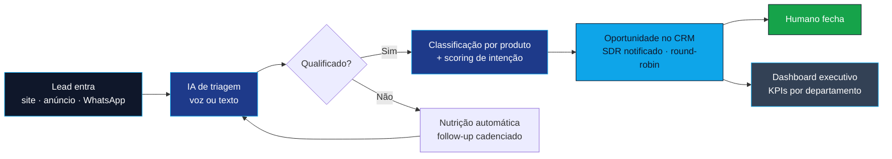

---

## 🧭 Quem sou

Meu trabalho é pegar processo comercial manual — atendimento, qualificação, follow-up — e transformar em **sistema que roda sozinho dentro de um CRM**.

Faço isso como técnico no **High Ticket Club**, uma das maiores agências afiliadas GoHighLevel do mercado. Curso **Ciência da Computação na Univértix (7º período)**, o que me dá base pra descer ao código quando o no-code trava.

> **Não entrego funil bonito. Entrego pipeline rodando em produção, com IA respondendo lead às 2h da manhã.**

---

## 🎯 O que eu resolvo

<table>
<tr>
<td width="33%" valign="top">

### 🧊 Lead que esfria na fila

Agentes de IA (**voz e texto**) que qualificam por conversa real, pontuam intenção e só devolvem pro humano o que vale fechar.

`VAPI` `ElevenLabs` `Conversation AI`

</td>
<td width="33%" valign="top">

### 📉 CRM que ninguém usa

Implantação de **GoHighLevel white-label ponta a ponta** — estrutura, snapshot, integração e onboarding. O sistema só serve se o time adotar.

`GHL` `Snapshots` `Onboarding`

</td>
<td width="33%" valign="top">

### ⏳ Trabalho repetitivo que come margem

Automações em **N8N** que substituem tarefa manual por fluxo: criação de subconta, distribuição de lead, scoring de call, dashboard executivo.

`N8N` `Webhooks` `REST API`

</td>
</tr>
</table>

---

## 🔁 Como o sistema funciona

---

## 🚀 Sistemas em produção

| Projeto | O que faz | Stack |
|---|---|---|
| **Agentes de voz com IA** | Atendimento e qualificação por voz, integrado ao CRM, com cadência de rechamada | `VAPI` `ElevenLabs` `Twilio` `GHL` |
| **Snapshots white-label** | Templates reutilizáveis de GoHighLevel por vertical (advocacia, odonto, concessionária, clínica estética, franquia) | `GHL` `Automações` `Custom Values` |
| **Automação de subconta** | Criação de subconta e preenchimento de custom values a partir do formulário de onboarding | `N8N` `Webhooks` `GHL API` |
| **Scoring de call por IA** | Transcrição e nota automática de ligação de vendas contra o script comercial | `N8N` `Whisper` `OpenAI` `Sheets` |
| **Funil + triagem por IA** | CRM do zero, triagem automática de lead, roteamento por produto e dashboard executivo | `GHL` `N8N` `Next.js` `Supabase` |
| **MatchGoal** | SaaS de analytics de futebol para a Copa do Mundo 2026 | `Next.js` `Vercel` `Supabase` `N8N` |

<b>📂 Por que a maior parte dos repositórios não está pública</b>

 

São sistemas em operação, com dados e credenciais de clientes ativos. O que eu consigo mostrar em conversa:

- Arquitetura do fluxo (diagrama e decisões de engenharia)
- Demo em ambiente controlado
- Trechos de workflow N8N e estrutura de prompt sanitizados

---

## 🛠️ Ferramentas

**Automação & IA**

**CRM & Vendas**

**Backend & Infra**

**Base**

---

## 📊 Painel

---

## 🔬 Pesquisa — TCC

> ### *Análise Comparativa entre Reuso Tradicional de Código e Desenvolvimento Assistido por IA Generativa*
> **Um Experimento Controlado sobre Produtividade** — Univértix

**📌 Questão central:** IA generativa torna devs mais produtivos — ou apenas mais rápidos em criar problemas novos?

**📊 Variáveis medidas:**

| Variável | O que mede |
|---|---|
| ⏱️ Tempo de conclusão | Velocidade real de entrega da tarefa |
| 🧩 Qualidade do código | Aderência a boas práticas e legibilidade |
| ✅ Aprovação em testes | Corretude funcional verificada |
| 🔧 Manutenibilidade | Custo de evoluir o código depois |

---

### 💬 Quer ver rodando?

Arquitetura, decisões técnicas e demo eu mostro em conversa.

