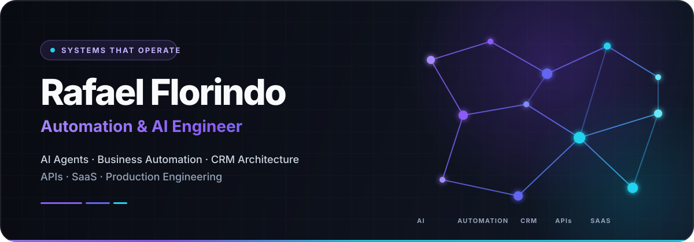
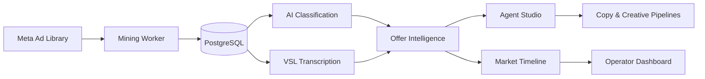
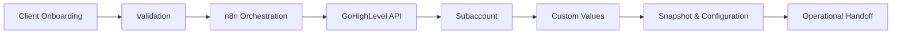
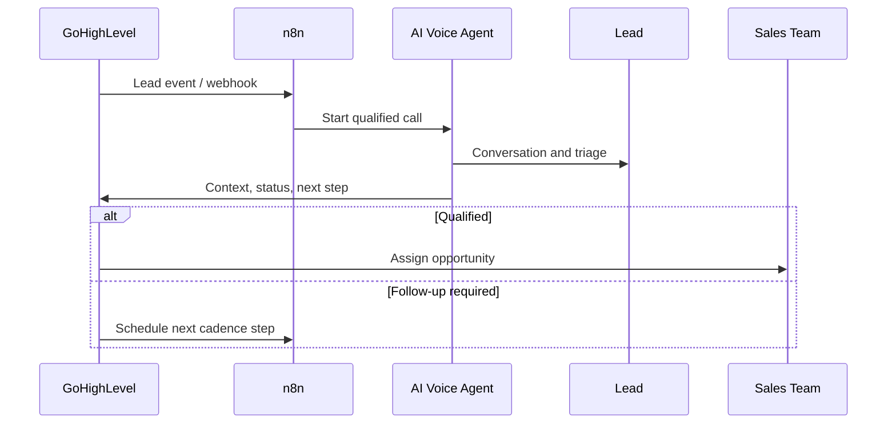
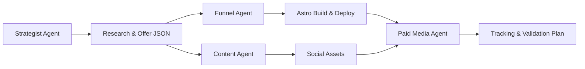
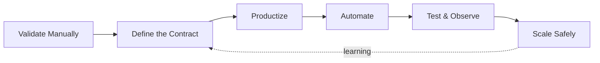

<p align="center">
  
</p>

<p align="center">
  <a href="https://www.linkedin.com/in/rafael-florindo">
    
  </a>
  <a href="mailto:rafaelflorindodev@gmail.com">
    
  </a>
  <a href="https://wa.me/5531997900284">
    
  </a>
</p>

<p align="center">
  <a href="#engineering-profile">Profile</a> ·
  <a href="#featured-systems">Featured Systems</a> ·
  <a href="#product-lab">Product Lab</a> ·
  <a href="#research">Research</a> ·
  <a href="#core-stack">Stack</a> ·
  <a href="#build-systems-that-keep-working">Contact</a>
</p>

---

## Engineering profile

I am an **Automation & AI Engineer based in Brazil**, working where artificial intelligence meets revenue operations, CRM architecture, APIs, and product engineering.

At **High Ticket Club**, I build technical implementations across GoHighLevel, automation, WhatsApp, AI, and reusable CRM infrastructure. I also contribute as an implementer at **Valente AI**, working on client systems, white-label environments, onboarding automation, dashboards, and integrations.

I move between two layers without treating them as separate worlds:

- **GoHighLevel and n8n** for speed, orchestration, and operational ownership;
- **Python, TypeScript, databases, APIs, workers, tests, and infrastructure** when the system needs custom logic or stronger engineering guarantees.

I am also a Computer Science student at **Univértix**, researching the real productivity impact of generative AI on software development.

> **I do not build automations just to eliminate clicks. I build systems that qualify, route, follow up, report, and recover when real-world operations become messy.**

<br>

<table>
  <tr>
    <td align="center" width="25%">
      <strong>340</strong><br>
      <sub>automated tests passing<br>in my flagship SaaS</sub>
    </td>
    <td align="center" width="25%">
      <strong>17 workflows</strong><br>
      <sub>in a complete vertical<br>CRM architecture</sub>
    </td>
    <td align="center" width="25%">
      <strong>~30 calendars</strong><br>
      <sub>mapped in one AI<br>booking operation</sub>
    </td>
    <td align="center" width="25%">
      <strong>55.8% faster</strong><br>
      <sub>result analyzed in my<br>AI productivity research</sub>
    </td>
  </tr>
</table>

---

## What I engineer

<table>
  <tr>
    <td width="33%" valign="top">
      <h3>AI Agents</h3>
      Voice and conversational agents for lead qualification, support, booking, triage, follow-up, routing, and human handoff.
      <br><br>
      <code>VAPI</code> <code>ElevenLabs</code> <code>Twilio</code> <code>OpenAI</code> <code>Gemini</code>
    </td>
    <td width="33%" valign="top">
      <h3>Automation & CRM</h3>
      Event-driven workflows, reusable GoHighLevel environments, lead scoring, onboarding, webhooks, API integrations, and operational reporting.
      <br><br>
      <code>GoHighLevel</code> <code>n8n</code> <code>REST APIs</code> <code>Webhooks</code>
    </td>
    <td width="33%" valign="top">
      <h3>Product Engineering</h3>
      Multi-tenant SaaS, internal tools, dashboards, background workers, data pipelines, and AI-assisted applications.
      <br><br>
      <code>Next.js</code> <code>Python</code> <code>PostgreSQL</code> <code>Supabase</code>
    </td>
  </tr>
</table>

---

## Featured systems

### 01 — Escaluz: AI offer intelligence platform

`FLAGSHIP SAAS` · `PRIVATE CORE` · `ACTIVE DEVELOPMENT`

**Escaluz** is the main product I am building: a multi-tenant platform that turns fragmented advertising research into a structured offer-intelligence workflow.

The platform mines the Meta Ad Library, classifies ads, tracks market movements, analyzes creatives, transcribes VSLs, reconstructs landing pages in isolated environments, models offers with specialized AI agents, and generates creative variations.


```mermaid
flowchart LR
    A[Meta Ad Library] --> B[Mining Worker]
    B --> C[(PostgreSQL)]
    C --> D[AI Classification]
    C --> E[VSL Transcription]
    D --> F[Offer Intelligence]
    E --> F
    F --> G[Agent Studio]
    G --> H[Copy & Creative Pipelines]
    F --> I[Market Timeline]
    I --> J[Operator Dashboard]
```

#### Product architecture

| Layer | Implementation |
| --- | --- |
| **Application** | Next.js App Router, React Server Components, TypeScript, Tailwind design system |
| **Data** | Prisma ORM, PostgreSQL, Supabase connection pooling, multi-tenant ownership boundaries |
| **Workers** | Dedicated asynchronous processing for mining, media download, transcription, page processing, and FFmpeg jobs |
| **AI providers** | Gemini for classification and agents, Groq Whisper for transcription, ElevenLabs/Edge-TTS for voice, creative generation providers |
| **AI cost model** | Provider usage is managed centrally by the SaaS so end users do not need to supply personal API keys |
| **Security** | Authenticated route coverage, tenant isolation, AES-256-GCM secret encryption, SSRF defenses, tracker sanitization, CSP sandboxing |

#### Engineering proof

- **340 tests passing across 47 test files**, verified locally in August 2026.
- Automated coverage for page authentication, API authentication, and cross-tenant ownership.
- Strict TypeScript application with zero lint errors in the latest verification.
- Dedicated operational scripts for workers, diagnostics, migrations, auditing, deduplication, repair, and job inspection.
- Architecture designed around production failure modes, not only successful demos.

`Next.js` · `TypeScript` · `Prisma` · `PostgreSQL` · `Vitest` · `Playwright` · `FFmpeg` · `AI APIs`

---

### 02 — AI + CRM revenue operations

I design GoHighLevel systems as operational architecture: acquisition, qualification, routing, follow-up, booking, sales, onboarding, reporting, and post-sale working as one connected system.

#### Selected implementation depth

| Operation | What was engineered | Scope |
| --- | --- | --- |
| **Legal services CRM** | Complete reusable snapshot organized by lifecycle and responsibility | **17 workflows / 5 folders** |
| **Dental CRM** | Acquisition, follow-up, booking, and operational workflows | **12 workflows** |
| **Aesthetic-services AI** | Procedure/professional triage and calendar routing | **~30 calendars** |
| **Franchise lead management** | Conversation AI, custom fields, scoring, and nurture | **8 scoring levels** |
| **Webinar operation** | WhatsApp, branded HTML email, Stripe, and funnel automation | **9 workflows** |
| **Internal service operation** | Lead capture through post-sale review | **11 workflows** |

I have also built white-label environments for automotive, pool-service, landscaping, contractors, and other local-service operations in Brazil and the United States.

#### Automated GoHighLevel provisioning


```mermaid
flowchart LR
    A[Client Onboarding] --> B[Validation]
    B --> C[n8n Orchestration]
    C --> D[GoHighLevel API]
    D --> E[Subaccount]
    E --> F[Custom Values]
    F --> G[Snapshot & Configuration]
    G --> H[Operational Handoff]
```

The provisioning layer reduces repetitive setup by creating subaccounts, distributing onboarding data, populating business-specific values, preparing snapshots, and clearly separating the steps that still require human authorization.

`GoHighLevel` · `Conversation AI` · `Voice AI` · `SaaS Mode` · `n8n` · `REST APIs` · `Webhooks`

---

### 03 — Voice agents and sales intelligence

#### AI voice agents

I built a reusable agent pattern connecting **VAPI, ElevenLabs, Twilio, n8n, and GoHighLevel**. These agents can trigger outbound calls from CRM events, qualify leads, book appointments, update contact context, run multi-day cadences, and transfer qualified opportunities to a human closer.

One production pattern includes a **7-day outbound call cadence** controlled by CRM events and n8n middleware.


```mermaid
sequenceDiagram
    participant CRM as GoHighLevel
    participant N8N as n8n
    participant Agent as AI Voice Agent
    participant Lead
    participant Sales as Sales Team

    CRM->>N8N: Lead event / webhook
    N8N->>Agent: Start qualified call
    Agent->>Lead: Conversation and triage
    Agent->>CRM: Context, status, next step
    alt Qualified
        CRM->>Sales: Assign opportunity
    else Follow-up required
        CRM->>N8N: Schedule next cadence step
    end
```

#### AI sales-call scoring

I also built an automated pipeline that turns recorded sales calls into structured coaching data:

```text
API4com recording
        ↓
Whisper transcription
        ↓
Structured LLM evaluation
        ↓
Script and sales-process comparison
        ↓
Score, missed opportunities, and recommendations
        ↓
Google Sheets reporting
```

The evaluator can analyze discovery quality, script adherence, objection handling, conversation quality, missed opportunities, and sales-process execution.

---

### 04 — Executive data and AI routing

For an energy company that started without a defined lead-management process, I helped structure the CRM, AI triage, product routing, and an executive dashboard spanning commercial, marketing, engineering, construction, and operations data.

The solution combines:

- generative Conversation AI for lead triage;
- LLM classification before deterministic workflow routing;
- native CRM assignment and opportunity management;
- n8n and Google Sheets for departments without source systems;
- a dedicated **Next.js + Supabase** application for weekly history, trends, status, and KPIs;
- GoHighLevel data pulled through a private integration.

[**View repository**](https://github.com/RafaellFlorindo/Dashboard-New-Energia) · [**Open live dashboard**](https://dashboard-new-energia.vercel.app)

`Next.js` · `TypeScript` · `Supabase` · `Recharts` · `n8n` · `GoHighLevel`

> Client implementations and production repositories are often private. I describe the engineering decisions and system boundaries without publishing credentials, internal URLs, personal data, or proprietary client logic.

---

## Product lab

Beyond client systems, I build products to explore repeatable business models, AI-native workflows, privacy-first applications, and vertical SaaS.

| Product | What it is | Engineering focus |
| --- | --- | --- |
| [**NotaZen**](https://github.com/RafaellFlorindo/NotaZen) | Offline-capable financial PWA for Brazilian solo entrepreneurs | Local-first repository layer, integer-cent calculations, CSV safety, JSON backup, accessibility, Vitest |
| **MatchGoal** | Collaborative football analytics SaaS for the 2026 FIFA World Cup | n8n integrations, Abacate Pay infrastructure, Next.js, Supabase, regulatory product wording |
| **Low Ticket Machine** | Four-agent system that takes a low-ticket product from audience research to funnel, content, and paid-media setup | JSON contracts, multi-niche architecture, Astro builds, HTML-to-PNG assets, Vercel deployment |
| **Era Uma Vez Você** | AI application that produces personalized content and assembles the final PDF | Next.js 16, React 19, Gemini, pdf-lib, Sharp, Zustand |
| [**NEW Energy Dashboard**](https://github.com/RafaellFlorindo/Dashboard-New-Energia) | Executive operational dashboard connected to CRM and weekly department data | Next.js, TypeScript, Supabase, Recharts, API integration |
| [**Skills for Claude Code**](https://github.com/RafaellFlorindo/Skills-Claude) | Curated library for AI-assisted copy, design, SEO, frontend, and review workflows | Reusable knowledge systems, Markdown skills, AI tooling |

### Low Ticket Machine — multi-agent product pipeline


```mermaid
flowchart LR
    A[Strategist Agent] --> B[Research & Offer JSON]
    B --> C[Funnel Agent]
    C --> D[Astro Build & Deploy]
    B --> E[Content Agent]
    E --> F[Social Assets]
    D --> G[Paid Media Agent]
    F --> G
    G --> H[Tracking & Validation Plan]
```

Each product lives in an isolated directory with research, offer, funnel, and build data. Changing the niche means changing structured configuration — not rewriting the core system.

---

## Research

### Generative AI × Software Engineering

My Computer Science thesis is a quantitative and descriptive secondary-data analysis of a controlled experiment comparing conventional development with GitHub Copilot-assisted development.

**Research title:**
*Comparative analysis between traditional code reuse and development assisted by generative artificial intelligence: secondary-data analysis of a controlled experiment.*

| Metric | Conventional development | Copilot-assisted development |
| --- | ---: | ---: |
| Completed observations | 35 | 35 |
| Mean completion time | 160.89 minutes | 71.17 minutes |
| Time difference | — | **55.8% faster** |
| Statistical result | — | **p = 0.0017** |
| Functional test difference | — | +7 percentage points, not statistically significant |

The defensible conclusion is specific: the dataset provides strong evidence of a speed gain, but not enough evidence to claim a significant improvement in functional quality.

That distinction matters to how I build software with AI: **faster code generation is useful only when testing, maintainability, security, and review remain part of the system.**

My academic work also includes **PageRank and Web Graphs with Python**, DevOps workflows and trunk-based development, IPv6 network labs, and IoT projects.

---

## How I build

My recurring product pattern is simple: validate the value first, then earn the complexity.


```mermaid
flowchart LR
    A[Validate Manually] --> B[Define the Contract]
    B --> C[Productize]
    C --> D[Automate]
    D --> E[Test & Observe]
    E --> F[Scale Safely]
    F -. learning .-> B
```

#### Engineering principles

1. **Production over demos** — design for retries, partial data, API failure, and human intervention.
2. **Business logic stays explicit** — tools can change; the operational contract cannot be hidden inside platform clicks.
3. **Reusable over repetitive** — convert recurring delivery into snapshots, schemas, templates, agents, and workflows.
4. **Proof over tool lists** — tests, architecture, working deployments, and clear decisions matter more than badge collections.
5. **Cost is part of architecture** — API usage, limits, multi-client isolation, infrastructure capacity, and margin influence product decisions.
6. **Honest output** — do not fabricate proof, call unfinished work complete, or misrepresent AI-generated assets as real events.

---

## AI-native workflow

I use AI as an execution and review layer, not only as a chat interface.

| Stage | Working model |
| --- | --- |
| **Context** | Obsidian knowledge base, project contracts, structured requirements, and reusable skills |
| **Discovery** | Claude, ChatGPT, and Gemini for research, product structure, copy, and design exploration |
| **Implementation** | Claude Code and Codex for repository work, architecture, refactoring, and test creation |
| **Isolation** | Branches and worktrees when parallel work could create collisions |
| **Verification** | Automated tests, security review, linting, builds, and visual inspection before delivery |
| **Learning loop** | Decisions and reusable context return to the knowledge base instead of disappearing into chat history |

The direction I am building toward is a coordinated multi-agent engineering workflow: clear ownership, parallel execution, cross-review, automated verification, and controlled integration.

---

## Core stack

| Domain | Technologies |
| --- | --- |
| **AI & Agents** | OpenAI, Gemini, VAPI, ElevenLabs, Twilio, Groq Whisper, structured LLM outputs, prompt engineering |
| **Automation** | n8n, webhooks, event-driven workflows, scheduled jobs, data processing, API orchestration |
| **CRM Engineering** | GoHighLevel, Conversation AI, Voice AI, pipelines, snapshots, SaaS Mode, custom fields and values, white-label theming |
| **Backend** | Python, FastAPI, Flask, Node.js, background workers, REST APIs |
| **Frontend** | TypeScript, JavaScript, Next.js, React, Vite, Astro, Tailwind CSS |
| **Data** | PostgreSQL, Supabase, Prisma, SQLite, Google Sheets |
| **Infrastructure** | Vercel, Docker, Linux, GitHub Actions, multi-tenant architecture |
| **Quality** | Vitest, Playwright, automated testing, security review, visual validation, Git and worktrees |

---

## Current focus

```javascript
const currentFocus = {
  flagship: "Escaluz — AI offer intelligence SaaS",
  professional: ["High Ticket Club", "Valente AI", "CRM & AI implementations"],
  engineering: ["AI agents", "multi-tenant SaaS", "reliable automation"],
  research: "Generative AI productivity in software engineering",
  expansion: "CRM, automation, and sites for the US market",
  workflow: "Multi-agent engineering with explicit review and isolation"
};
```

Outside the terminal, I enjoy **CS2**, hardware tuning, and spending time with my dog.

---

<div align="center">

## Build systems that keep working

If you are building **AI agents, business automation, CRM infrastructure, internal tools, API integrations, or SaaS**, let's talk about the system behind the idea.

<br>

<a href="https://www.linkedin.com/in/rafael-florindo">
  
</a>
<a href="mailto:rafaelflorindodev@gmail.com">
  
</a>
<a href="https://wa.me/5531997900284">
  
</a>

<br><br>

**Rafael Florindo**
`Automation & AI Engineer · Brazil`

</div>
