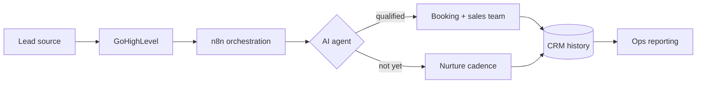

  

  
  
  

  

## About

**I don't automate clicks. I engineer the system behind the operation.**

I'm an **Automation & AI Engineer** from Brazil. I build the technical layer behind revenue operations: AI agents that qualify and book, CRM architecture that doesn't fall apart at scale, API integrations, internal tools and multi-tenant SaaS.

At **High Ticket Club** I work as a GoHighLevel & automation specialist and run the daily *Office Hours*, supporting members live. As an implementer at **Valente AI** I ship client systems, white-label environments, onboarding automation and dashboards. On the side, I build my own products.

My work lives between two layers that are usually treated separately:

- **fast operational delivery** with GoHighLevel, n8n, webhooks and AI services;
- **real product engineering** with TypeScript, Python, Postgres, workers, tests and production safeguards.

  

## Selected work

<table>
<tr>
<td width="50%" valign="top">

### ⚡ Escaluz
**AI offer-intelligence SaaS** · `flagship` · `private`

Mines the Meta Ad Library via GraphQL interception, classifies ads with AI, tracks offer longevity over time, extracts VSLs, detects competitors' tech stack and pixels, and models new offers with specialized copy agents plus a zero-API-cost video pipeline.

**694 tests** in 94 files · CI green · multi-tenant isolation, AES-256-GCM secrets, SSRF defenses, CSP sandboxing, RLS guarded by AST tests.

`Next.js` `TypeScript` `Prisma` `Postgres` `Vitest` `Playwright` `FFmpeg`

</td>
<td width="50%" valign="top">

### 📞 Growth Dealer
**Sales Growth OS** · `private`

Parallel dialer (up to **10 lines**) with Twilio AMD that connects the SDR to the first human who answers, plus autonomous **ElevenLabs voice agents** that qualify and book meetings. Built-in lead engine from **open CNPJ data + OpenStreetMap**, with zero paid lead APIs.

Killed a 30s timeout by co-locating Vercel and Supabase in `gru1`: **~120 ms → <5 ms** per query under a global lock.

`Next.js` `Twilio WebRTC` `ElevenLabs` `Postgres` `pg_cron`

</td>
</tr>
<tr>
<td width="50%" valign="top">

### 💬 ZapCRM
**CRM inside WhatsApp Web** · `private`

Chrome extension (Manifest V3) that overlays a visual pipeline, compact kanban, `/` quick replies and funnel metrics on WhatsApp Web. Isolated with Shadow DOM, client-only, no backend.

Designed, built and tested in **one day** with Codex CLI + Claude Code orchestration: **48 tests** (28 unit + 20 browser).

`React` `TypeScript` `Vite` `Shadow DOM` `Playwright`

</td>
<td width="50%" valign="top">

### 🩺 Vértice Med
**Question-based study platform for medicine** · `private MVP`

Co-founded with a physician-educator. An *inverted cycle* where the student answers first, then gets the per-option explanation, the preceptor's tip and a mini-lesson. Clinical content uses **immutable versioning**, and there's a deterministic multi-persona demo mode for institutional pitches.

From meeting transcript to tested MVP in hours: **38 tests**, deployed on Vercel.

`Next.js` `Drizzle` `SQLite/Postgres` `Vitest`

</td>
</tr>
</table>

### 🤖 AI + CRM revenue operations

I treat GoHighLevel as operational architecture: acquisition → qualification → routing → follow-up → booking → sale → onboarding → reporting, connected by explicit business rules.

| Operation | What was engineered | Scope |
| --- | --- | ---: |
| **Legal services CRM** | Reusable lifecycle architecture organized by responsibility | **17 workflows** |
| **Aesthetic-services AI** | Procedure & professional triage with calendar routing | **~30 calendars** |
| **Voice agents** | VAPI + ElevenLabs + Twilio + n8n + GHL, 7-day outbound cadence | **4 agents** |
| **Sales-call scoring** | Recordings → Whisper → structured LLM scoring against the script | **auto-graded calls** |
| **Subaccount provisioning** | Onboarding form → n8n → GHL subaccount + custom values | **zero manual setup** |
| **Energy company** | CRM stages, LLM triage before deterministic routing, exec dashboard | [**live repo →**](https://github.com/RafaellFlorindo/Dashboard-New-Energia) |

```mermaid
flowchart LR
    A[Lead source] --> B[GoHighLevel]
    B --> C[n8n orchestration]
    C --> D{AI agent}
    D -->|qualified| E[Booking + sales team]
    D -->|not yet| F[Nurture cadence]
    E --> G[(CRM history)]
    F --> G
    G --> H[Ops reporting]
```

<b>🧪 Product lab: more things I've built</b>

 

| Product | What it is | Engineering focus |
| --- | --- | --- |
| [**NotaZen**](https://github.com/RafaellFlorindo/NotaZen) | Offline-first finance PWA for Brazilian solo entrepreneurs (MEI) | Local-first data, integer-cent math, CSV/JSON export, a11y |
| [**VIX General Services**](https://github.com/RafaellFlorindo/vixgeneralservice) | High-conversion site for an HVAC/electrical contractor in New England | GEO for AI search: `llms.txt`, Schema.org `@graph`, GHL integration |
| [**SV Rental Car**](https://github.com/RafaellFlorindo/SV-RENTAL-CAR-LLC) | Private chauffeur site in Scottsdale, AZ | Anti-"AI slop" design rules, local SEO, Framer Motion |
| **MatchGoal** | Football analytics SaaS for the 2026 World Cup | n8n integrations, payments, regulatory-safe product language |
| **Low Ticket Machine** | 4-agent pipeline: market research → funnel → content → ads | JSON contracts between agents, multi-niche |
| **Era Uma Vez Você** | Personalized AI-generated story assembled into a PDF | Next.js 16, Gemini, pdf-lib, Sharp |
| [**Skills for Claude Code**](https://github.com/RafaellFlorindo/Skills-Claude) | Reusable skills for copy, design, SEO, frontend and review | Knowledge systems for AI agents |

> Most client work and my SaaS cores are private. I share architecture, boundaries and verifiable numbers without exposing credentials, client data or proprietary logic.

## Research: generative AI × software engineering

Computer Science at **Univértix** (final stretch). My thesis re-analyzes data from a controlled experiment comparing conventional development with GitHub Copilot, and was presented as a poster at **FAVE 2026**.

| Metric | Conventional | Copilot-assisted |
| --- | ---: | ---: |
| Completed observations | 35 | 35 |
| Mean completion time | 160.89 min | **71.17 min** |
| Difference | | **55.8% faster** · `p = 0.0017` |
| Functional tests | | +7 p.p. · *not statistically significant* |

The honest conclusion is narrow: **strong evidence of speed, not enough evidence of better quality.** That's exactly why I keep tests, security review and human judgment inside every AI-assisted workflow I run.

## Stack

   
   
  

| Domain | Tools |
| --- | --- |
| **AI & agents** | OpenAI, Claude, Gemini, Grok, ElevenLabs, VAPI, Whisper, structured outputs |
| **Automation & CRM** | GoHighLevel (workflows, Conversation AI, Voice AI, snapshots, SaaS Mode), n8n, webhooks |
| **Telephony** | Twilio Voice (WebRTC, AMD, TwiML), managed subaccounts, spend limits |

<b>🧠 How I work with AI (the multi-agent setup)</b>

 

I use AI as an execution and review layer, not just a chat window.

| Stage | How |
| --- | --- |
| **Context** | An Obsidian second brain (1,000+ notes) that agents read and maintain: decisions, projects, patterns |
| **Orchestration** | One lead agent decomposes the work; specialists handle frontend, backend and tests in separate worktrees |
| **Implementation** | Claude Code and Codex CLI on real repositories, with atomic, reviewable commits |
| **Verification** | Cross-model audits, multi-angle code review, Playwright E2E, security sweeps, ephemeral Postgres rehearsals before migrations |
| **Learning loop** | What worked goes back into the brain instead of dying in chat history |

## How I build

1. **Production over demos.** Retries, partial data, API failures and human handoff are design inputs.
2. **Explicit business logic.** Tools change; the operational contract shouldn't disappear inside platform clicks.
3. **Reusable delivery.** Recurring work becomes snapshots, schemas, templates, agents and tested workflows.
4. **Cost and security are architecture.** Tenant isolation, API margins and privacy are product constraints.
5. **Proof over badges.** Tests, deployments and decisions carry more weight than a list of logos.

<picture>
  <source media="(prefers-color-scheme: dark)" srcset="https://raw.githubusercontent.com/RafaellFlorindo/RafaellFlorindo/output/snake-dark.svg">
  <source media="(prefers-color-scheme: light)" srcset="https://raw.githubusercontent.com/RafaellFlorindo/RafaellFlorindo/output/snake.svg">
  
</picture>

## Let's build the system behind the idea

Working on **AI agents, revenue automation, CRM infrastructure, internal tools or SaaS**? Let's talk.

 

